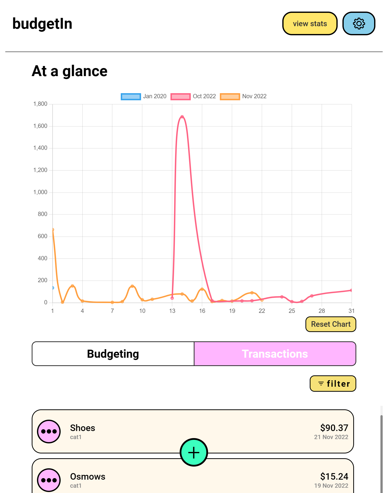

# Personal Budgeting Software 📊
Welcome to our Personal Budgeting Software, a modern, user-friendly application designed to help you manage your finances with ease. Utilizing Python for backend functionality and a web-based (Pure HTML, CSS and Jaavscript) frontend, this software offers interactive graphs, a sleek UI for transaction management, and much more with mobile first approach.

## Features
- **Interactive Graphs:** Visualize your spending and saving patterns with our interactive graphs.

- **Modern UI:** A clean and intuitive user interface for adding and viewing transactions.

- **Bulk Transaction Uploads:** Conveniently add multiple transactions at once.

- **Categories and Labels:** Not just categories, but labels too! Categorize your transactions (e.g., Online Shopping) and add labels (e.g., Amazon, BestBuy) for detailed classification.

## Planned Future Enhancements:
- Integration with Large Language Models for improved user interaction.
- Stable Diffusion API for generating unique logos for categories and labels.

 

# Installation
## Clone the repository
git clone https://github.com/SomaRe/budgeting

## Navigate to the project directory
cd personal-budgeting-software

## Install dependencies (if any)
pip install -r requirements.txt

## Run the application
python main.py

## Usage
Follow these simple steps to get started:

**Add a Transaction:** Click on the '+' button and fill in the details.

**View Transactions:** All your transactions are displayed in an easy-to-navigate format.

**Analyze with Graphs:** Check the 'Graphs' section to see your financial trends.

**Categorize and Label:** Use categories and labels for detailed tracking of your expenses.

## Contributing
Contributions to improve Personal Budgeting Software are welcome. Please follow these steps to contribute:

- Fork the repository.
- Create a new branch (git checkout -b feature-branch).
- Make your changes.
- Commit your changes (git commit -am 'Add some feature').
- Push to the branch (git push origin feature-branch).
- Create a new Pull Request.

## License
Distributed under the MIT License. See LICENSE for more information.